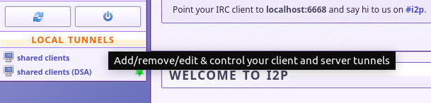
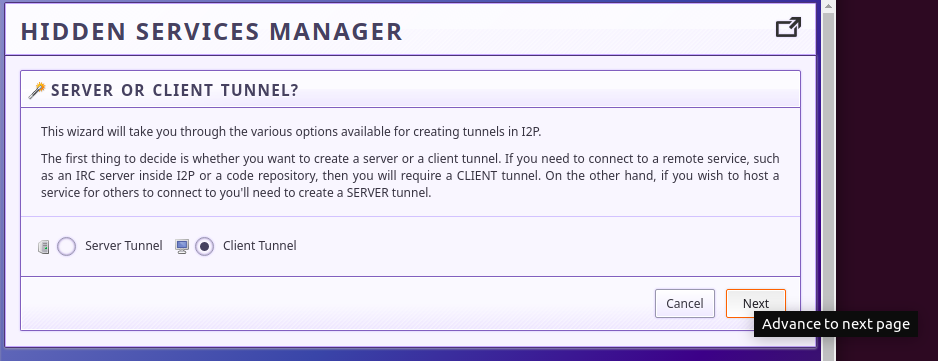
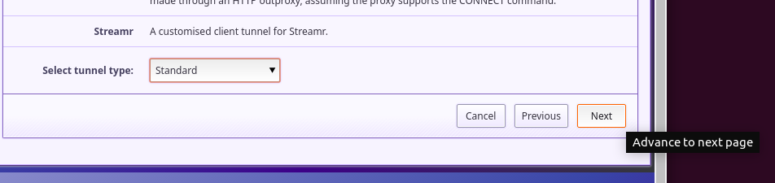

# i2p-nntp-client

Guide, with pictures, to configuring a tunnel for an NNTP client for i2p.

It occurs to me that I've never actually been to neodome. I can take absolutely
no responsibility for what neodome or it's users promote on their site, I
have literally never seen anything beyond their landing page and the configs
posted at r/i2p. I really hope they're not assholes.

